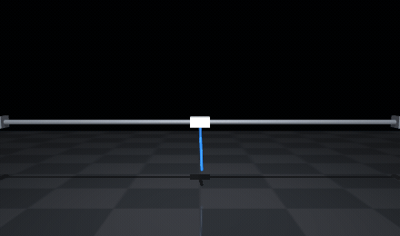
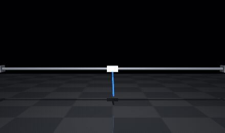
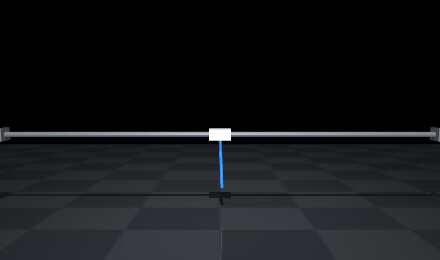
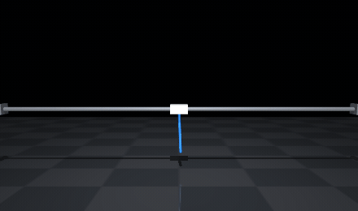

# PID_RL_Tuneing

Swing-up and balance of an **N-link inverted pendulum on a belt-driven linear carriage**,
in C++ end to end — hand-rolled dynamics, an LQR baseline, and a hand-written PPO on
LibTorch. The trained policy is meant to run on a Raspberry Pi driving real hardware.

Two things make this more than another cartpole:

- **N is a parameter, not a constant.** The dynamics, the controller, the LQR design and
  the RL observation all generalise over link count (`core::kMaxLinks = 6`).
- **The simulation models the hardware it is meant to transfer to** — actuator force
  droop, step loss, encoder quantisation, sensing latency, and a controller that only
  ever sees the carriage position it has dead-reckoned, never the truth.

No physical rig exists yet. Every hardware number below is a *specification to buy
against*, derived by running the design, not a measurement.

---

## Results

**N=1 swings up from hanging and balances, learned end to end.** No trajectory optimiser,
no energy-pumping law, no mode switching, no handoff logic — one 64×64 network emitting
carriage acceleration at 100 Hz, trained by the PPO in `rl/` against a reward that only
ever says how upright the link is.

| | |
|---|---|
| Best evaluation return | **3,823** of a 4,000 ceiling |
| Iterations to solve | **60** — first evaluation past 90% of ceiling |
| Swing-up time | **0.31 s**, hanging to within 15° and staying there |
| Steady-state error | **0.03°**, with command effectively zero |
| Held at ceiling | 28 of 34 evaluations, iterations 60 → 620 |
| Cost | 670 iterations, 2.7 M policy steps, CPU only |

**→ [Full training report](https://claude.ai/code/artifact/bcb578e5-8670-4a0b-9ce6-654ac8fb33ed)** —
13 interactive charts: learning curves, PPO diagnostics, trajectories, phase portrait, and
every number in tables underneath.

### What it looks like

Replays of the actual logged evaluation episodes at four points in training, rendered in
MuJoCo. These are `core::Plant`'s own recorded states played back frame by frame — MuJoCo
is the viewer here, not the physics.

| Iteration 0 — untrained | Iteration 40 — learning |
|---|---|
|  |  |
| Hangs. Actions are near-zero noise by construction — the policy head is initialised with gain 0.01 precisely so the first rollouts do not slam into the rail. | Gets it upright, then wanders to **0.96 m** of a ±1.0 m rail. Half the episode is spent above horizontal, and it never settles. |

| Iteration 60 — first solve | Iteration 600 — refined |
|---|---|
|  |  |
| Upright at 0.65 s and holds. Cart swings out to 0.64 m to get there. | Upright at 0.31 s, cart peaks at 0.34 m and returns near centre. Same task, half the time and half the rail. |

### Three things the run showed that the design did not predict

**There is no energy pumping.** The roadmap below assumes it, and at these numbers it never
appears. 30 m/s² is about 3g, and a 0.25 m rod has a natural period near 0.8 s, so the cart
whips the link over inside *half a swing*. That is a property of the specified drive, not of
the policy — an actuator sized closer to the ~7.5 N figure would have to pump, and this
result would not transfer.

**Getting upright and staying there quietly were learned hundreds of iterations apart.** At
iteration 340 the policy held the link to within a degree by reversing the command on
**199 of 200** steps — a limit cycle at the control rate, the behaviour that would chew
through a real belt. By iteration 600 mean |action| in the hold was **0.000**. The term that
decided it was `action_weight = 0.01`, a hundred times smaller than the alignment term and
irrelevant right up until every remaining candidate was already perfectly upright.

**It collapsed.** At iteration 635 a single update reported `kl 0.104` against a 0.02 target,
`clip 0.33`, and `epochs 2` instead of 10 — the KL early-stop firing on the update that broke
it. Episodes went from 800 steps to 10 and never recovered. Entropy had decayed to 0.06 over
the preceding 400 iterations, leaving a near-deterministic policy with no spread left to
absorb a large step. `entropy_coefficient = 0.01` was not enough.

Two consequences worth carrying forward: **evaluation gave no warning** — the greedy policy
scored 3,817 while the sampled rollouts it trained on were averaging 405 of 800 steps, and a
policy that only survives with the noise turned off is one bad step from not surviving at
all. And `torch::save` runs unconditionally on every evaluation, so **the checkpoint on disk
is the collapsed policy**, not the one that scored 3,823. Save-on-best is the first fix.

### The bug that cost the first run

The first full training run died with episodes lasting **2 policy steps** and returns of
−108 — the −100 termination penalty plus a couple of steps of hanging. The cart had not
moved far enough to reach the rail, so the terminations had to be step loss.

`plant_config()` set `max_accel = 30` m/s² but left the force envelope at the
`StepperLimits` header defaults, where `holding_force = 10 N`. Accelerating 0.82 kg at
30 m/s² needs about 25 N, so `would_lose_steps()` fired on the first plant step of every
episode. The hardware sizing had already concluded a stepper could not do this job and
specified a 400 W servo; the config simply never caught up.

That is what `config.json` and its strict loader exist for. Every key is required, no
defaults are applied, and the loader now rejects a `holding_force` below
`(carriage_mass + Σ link masses) × max_accel` outright:

```
config error: in 'config.json': 'actuator.holding_force' is 10.000000 N but accelerating
0.820000 kg at 30.000000 m/s^2 needs at least 24.600000 N; every episode would trip step
loss immediately
```

---

## Status

| Module | State |
|---|---|
| `core/` — plant, controller, actuator, sensors | Implemented, validated |
| `baseline/` — linearise + Riccati LQR | Implemented, measured (N=1) |
| `sim/` — RL environment | Implemented, 99 checks green |
| `rl/` — PPO, actor-critic, GAE rollout buffer | Implemented. **N=1 swing-up solved**, see Results |
| `config/` — `config.json` → populated structs | Implemented, strict |
| `tools/` — MuJoCo model generator and viewer | Implemented, replay only |
| `pi/` — real-time control loop | Stub. Waits on hardware |

10 ctest targets green as of 2026-08-13.

---

## The plant

An N-link chain of unactuated joints on a carriage that translates along a rail. The
**only** control input is carriage acceleration.

    A(th) alpha = g (h .* sin th) - a (h .* cos th) - C(th) (om .* om) + Q

    A_ik = D_ik cos(th_i - th_k)
    C_ik = D_ik sin(th_i - th_k)

`A` is a mass matrix — symmetric positive definite, solved with LDLT. Integration is RK4
at 500 Hz with a zero-order hold on the command; Euler was rejected because an integrator
that injects energy makes the plant *easier* to stabilise than reality, and gains tuned
against it transfer wrong.

**The carriage is a position source, not a free body.** A belt drive is commanded in
acceleration, so the motion is prescribed and the belt force needed to enforce it comes
back out of the solve — which is what a step-loss check tests against.

### Design decisions worth knowing

- **Hand-rolled ODE, not MuJoCo.** There is no contact to model, and log-and-replay
  recalibration needs identifiable physical parameters rather than solver softness knobs.
  MuJoCo *is* in the repo now (`tools/`), but strictly as a viewer: it replays states
  `core::Plant` already produced and never integrates anything. Keeping playback free of
  MuJoCo's integrator means that if the two engines are ever compared, a disagreement
  cannot be mistaken for a rendering artifact.
- **Belt drive, not a lead screw.** A lead screw cannot accelerate fast enough for the
  ~130 ms instability time constant of a 0.25 m link.
- **All C++ including the RL.** Hand-writing PPO is a goal of this project, not a cost.
- **Storage is `Eigen::Matrix<double, Dynamic, Dynamic, 0, kMaxLinks, kMaxLinks>`** —
  runtime link count with a compile-time maximum, so N stays a runtime value while the
  storage remains a fixed inline array. Nothing in the hot loop touches the heap.

---

## Repository layout

```
config.json Every hardware and run number. The single source of truth
core/       Shared with the Pi. Eigen only, no other dependencies.
            plant, controller (2N+3 state feedback), actuator, sensors, delay_line
baseline/   LQR: linearize + solve_dare + envelope_report
sim/        Desktop only. The RL environment: observation, reward, termination
config/     config.json -> populated core/sim structs. Strict: no defaults
rl/         LibTorch. ActorCritic, RolloutBuffer (GAE), Ppo, training entry point
tools/      Python. MuJoCo model generator and trajectory viewer
pi/         Raspberry Pi real-time loop. Not built by the desktop configure
tests/      Layered validation, run under ctest
```

Dependency order is `core → sim → config → rl`, with `config/` keeping the JSON parser off
`sim`'s include path and well away from `core`, which cross-compiles to the Pi against Eigen
and nothing else.

`pi/` deliberately links `core/` only. The trained policy arrives as **exported weights**,
not as a LibTorch dependency — LibTorch on ARM is a heavy runtime with allocation
behaviour you do not want inside a loop holding 500 Hz with tight jitter.

---

## Building

Requires CMake ≥ 3.21, Ninja, MSVC, and LibTorch. Eigen is fetched automatically
(header-only, `FetchContent`, no vcpkg in the chain).

```powershell
cmake --preset msvc-release
cmake --build --preset msvc-release
ctest --preset msvc-release
```

Builds land at `%LOCALAPPDATA%/pidrl-build/<preset>`, out of the source tree.
`PIDRL_BUILD_RL=OFF` skips LibTorch entirely if you only want the physics and the
baseline — `rl/` is its only consumer.

The trainer is the `train` target. Run it from wherever you want its logs, since it writes
them to the working directory. It reads `config.json`, searching upward from the executable
if it is not in the working directory; pass a path to override:

```powershell
& "$env:LOCALAPPDATA\pidrl-build\msvc-release\rl\train.exe"
& "$env:LOCALAPPDATA\pidrl-build\msvc-release\rl\train.exe" my-sweep.json
```

### Watching it

`tools/` needs Python with `mujoco` (`pip install mujoco`) and, for video export, `ffmpeg`.
The model is **generated** from `config.json` — never hand-edit `tools/pendulum.xml`, or the
second source of truth this project just spent a refactor eliminating comes straight back.

```powershell
python tools\make_mjcf.py                                  # config.json -> pendulum.xml
python tools\view.py --traj <run>\trajectory_600.csv       # interactive, real time
python tools\view.py --traj ... --end 1.5 --speed 0.2      # slow-mo swing-up
python tools\view.py --traj ... --gif out.gif              # or --video out.mp4
python tools\view.py                                       # just the model, hanging
```

`--end` matters more than it sounds: swing-up is 0.31 s of an 8 s episode, so the default
view is mostly a pendulum standing still.

LibTorch itself is not fetched — download the **Release**, CXX11-ABI, CPU build and point
`CMAKE_PREFIX_PATH` at it (the presets hardcode a local path; override it in
`CMakeUserPresets.json`, which is gitignored for exactly this).

### Three traps this toolchain reliably sets

1. **LibTorch ships separate Debug and Release builds and you must match your config.**
   Mismatching gives link errors, or heap corruption at runtime. The DLLs also have to
   sit next to the executable, which needs an explicit post-build copy step.
2. **MSYS2 on `PATH` poisons the cache.** A configure that runs before the MSVC
   environment is ready auto-detects MinGW `g++` and caches the GNU linker. `CMAKE_LINKER`
   is never re-derived, so pinning the compiler later does not undo it — you get `cl.exe`
   compiling and `ld.exe` linking, failing with pages of `cannot find /nologo`. The
   top-level `CMakeLists.txt` fails loudly on this.
3. **Two VS 2022 installs, two toolsets.** Build under an environment whose `INCLUDE`
   points at a newer STL than the cached `cl.exe` and you get
   `STL1001: Unexpected compiler version` plus hundreds of cascade errors inside
   `<type_traits>` — none naming a file in this project. `CMakePresets.json` pins toolset
   14.36; the build also checks the compiler's toolset directory against `INCLUDE`
   directly, because comparing `CMAKE_CXX_COMPILER_VERSION` against a floor cannot see it
   (the compiler really is 19.36 in both the working and the broken case).

Either failure is fixed by wiping the cache:
`Remove-Item -Recurse -Force "$env:LOCALAPPDATA\pidrl-build"`.

---

## Validation

Not unit tests in the usual sense — they are layered, and the layering is the point. Each
closes a hole the one below it cannot see.

| Test | What it pins |
|---|---|
| `types`, `controller`, `delay_line`, `actuator`, `sensors` | Component contracts. Mostly written against bugs actually found |
| `physics_validation` | N=1 only, where `alpha = (3/2L)(g sin th - a cos th)` is derivable by hand. Pins the **absolute scale** of `h_` and `D_`, which conservation cannot — conservation is invariant to a common factor |
| `energy_conservation` | N=1..3 with deliberately dissimilar links. Checks `Plant::energy` against link geometry, then conservation under RK4, then belt force via the work-energy theorem |
| `lqr_test` | 181 checks on the baseline pipeline |
| `env_test` | 99 checks on the RL contract |

Measured numbers:

- `Plant::energy` matches an independent geometry-based implementation to **6.2e-16** over
  1200 random states.
- Free energy drift is **~5e-9 relative at N=3**.
- RK4 order confirmed at **14×** on halving `dt`.

The two physics tests write an HTML report next to their binary. Reading it is how a
regression gets diagnosed; the exit code only says one happened.

---

## LQR baseline

Run before PPO for three reasons, in descending order of value: it answers *"is this plant
stabilisable at all inside the actuator envelope"* from a solve rather than from a
training run that quietly fails to converge; it gives an initialisation that is already
stabilising; and it is the number the policy has to beat.

Where LQR structurally cannot win is latency, quantisation, saturation and parameter
spread — none of which appear in the linear model. **That gap is the sim-to-real problem**,
so measuring it is a deliverable of the module, not an afterthought.

**Method.** State is augmented to `z = [x, xdot, ∫x, theta, omega]` (2N+3) so the mapping
to `Gains::to_flat` is the identity and no call site carries an index offset. `A` and `B`
come from **central-differencing `Plant::step` itself** rather than an analytic Jacobian —
no matrix exponential, no second derivation to keep in sync, and the model is
automatically the one the controller actually faces, RK4 and zero-order hold included.
Solved by backward iteration on the discrete Riccati equation. `Q` and `R` come from
Bryson's rule over hardware-derived tolerances, so a domain-randomised `StepperLimits`
re-derives its own weights.

Designed **delay-free on purpose**: delay states cost ~10 dimensions per delayed signal at
20 ms / 500 Hz, tripling the model. Instead the delay-free gains get run through the full
sim *with* latency on, and what is lost is measured — that number is the size of the gap
RL exists to close, and is not yet known.

### Measured result (N=1, 2026-08-12)

Single uniform rod, 0.1 kg / 0.3 m, 0.5 kg carriage, 500 Hz. Default `StepperLimits`.

```
DARE: 6203 iterations, converged, relative residual 9.92e-13
closed-loop spectral radius 0.998059

kp_x -23.47   kd_x -19.02   ki_x -12.03   kp_theta -86.41   kd_theta -11.32
```

**Every tilt stabilises mathematically; only the actuator runs out.** Peak demand is
exactly linear in the initial tilt, because the opening command is `kp_theta * theta_0`
and nothing else:

    max recoverable tilt = max_accel / |kp_theta| = 5.0 / 86.4 = 0.058 rad = 3.32 deg

Excursion peaked at 0.021 m against a 0.5 m rail. **Acceleration is the binding
constraint, by more than an order of magnitude** — the rail is nowhere near it.

Two calibration findings, both measured:

- *Acceleration headroom.* `from_envelope` originally priced the step-loss boundary as
  merely "tolerable" by setting the accel tolerance to `max_accel` exactly. Halving it
  moved `kp_theta` from −180.3 to −103.2 and the recoverable tilt from 1.6° to 2.78°.
- *Integral weight.* The intuition that "integral action costs phase margin, so loosen it"
  is **wrong here**, and a sweep against a rail off level by 1° says so: weakening the term
  drives the integrator's own pole toward z = 1 (ρ 0.9976 → 0.99998 across 0.05 → 20, with
  Riccati hitting its iteration cap). The real trade is against `kp_theta` — a weaker
  integral leaves less authority on position, so `kp_theta` falls and the basin widens
  (2.78° → 3.72°) while disturbance rejection slows from seconds to never-within-20 s.
  Settled on 0.20: basin 3.32° at zero steady-state error, ρ 0.99806.

  *Caveat:* the cost that would argue for going looser — phase lag eating stability margin
  — is invisible to a design that is delay-free by construction. Revisit once the gains
  have been through `SensorModel` and the actuation delay.

### The difficulty cliff

Balance basin, uniform 0.3 m rods at 5 m/s²:

| N | basin |
|---|---|
| 1 | 3.32° |
| 2 | 1.46° |
| 3 | 0.86° |

Roughly halving per link. This is a cliff, not a gradient, and it is the central known
risk. Two mitigations are identified: a network emitting *state-dependent* gains, and the
fact that with feedforward tracking the feedback only has to absorb tracking error rather
than catch a fall — a much weaker requirement.

---

## The RL environment

The contract any RL code must match. `sim/include/sim/env.hpp`.

- **Observation**, `2 + 3N` doubles:
  `[x/(rail/2), xdot/max_velocity, then per link: sin(theta), cos(theta), omega/omega_scale]`
- **Action**: one scalar in [−1, 1], scaled to ±`max_accel`, clamped in the env.
- **Reward** per plant step:
  `mean_i(cos(theta_i − theta_ref_i)) − 0.1·x² − 0.01·a²`, so upright scores **+1/step at
  any link count**. Off-rail and step-loss each subtract 100 and end the episode.

**The network outputs carriage acceleration directly, every control step.** One learned
behaviour covering swing-up and balance — no gain vector, no mode switching, no handoff
logic, no trajectory optimiser. It is a genuine MDP, so PPO does what PPO is for. An
earlier "the policy emits gains" formulation was abandoned; `Controller` and its 2N+3 gain
law survive only as the LQR baseline.

Decisions and why:

- **sin/cos instead of the raw angle.** Swing-up runs theta through several revolutions,
  so the same pose recurs at θ, θ±2π. sin/cos collapses those to one input and removes
  every wrapping concern downstream — there is no `wrap_angle` anywhere in the RL path.
  Locked by a test asserting the observation is identical across ±3 turns.
- **`control_decimation = 5`** — policy at 100 Hz, plant at 500 Hz. Not a performance
  tweak: at 500 Hz a discount of 0.99 looks 0.2 s ahead, which cannot represent a swing-up
  lasting seconds. It is also a zero-order hold, which is what the hardware does anyway.
- **The actuator is always in the loop**, and the observed `x`/`xdot` are the actuator's
  *dead-reckoned belief*, never truth. No sensor observes the cart, so the belief is
  exactly what the Pi will have.
- **Termination is judged on truth, not belief.** The rail end is a physical fact, and
  after step loss the belief is precisely what has stopped being trustworthy.
- **`use_sensor_model` defaults false.** True angles train faster; flipping it on routes
  everything through `SensorModel` (quantised, noisy, delayed, filtered rates). Observation
  size is unchanged either way, so trained policies stay compatible. **Turn it on before
  believing any sim-to-real claim.**
- **`done` and `truncated` are separate fields.** PPO must bootstrap `V(s_T)` on time-limit
  truncation and must not on real termination. Collapsing them is a classic and silent PPO
  bug.
- **`theta_ref` is the entire "which links up, which down" feature.** Every combination of
  link angles in {0, π} is an equilibrium, so an N-link chain has 2^N of them and "link 1
  up, link 2 down" is a legitimate setpoint — a reward parameter, nothing structural.

### A bug this work surfaced

`Plant::step` integrates position as `x += xdot·dt + ½a·dt²` while `Actuator::apply` used
`position += velocity_new·dt`. Those differ by `½a·dt²` every step, so the dead-reckoned
belief drifted from truth **with no step loss involved** — quietly breaking the invariant
the actuator header claims. Fixed to trapezoidal and locked by a test running 2000 random
commands asserting belief == truth to 1e-12.

---

## PPO

Hand-written, on LibTorch. Separate actor and critic trunks — shared trunks save parameters
but couple the policy and value gradients, and at this size the parameters are free and the
coupling is not.

Defaults: lr 3e-4, clip 0.2, `gamma` 0.995 (≈2 s of lookahead at the decimated 100 Hz
policy rate — change the decimation and this changes with it), `lambda` 0.95, 10 epochs,
minibatch 256, 4096 policy steps per update, early stop at `approx_kl` 0.02.

Three things in here are easy to get wrong and expensive:

- **Normalise advantages per minibatch**, not once over the batch. Whitening the whole
  batch leaks information across minibatches and shifts the effective step size.
- **The loss maximises the surrogate, so it is negated.** A sign error trains a policy that
  is confidently and increasingly wrong — which reads as "PPO diverges", not as a sign
  error.
- **Orthogonal init with gain 0.01 on the policy head.** Default init makes initial actions
  large and value estimates arbitrary, producing enormous early advantages and a first
  update that destroys the policy.

`RolloutBuffer` is kept separate from the update on purpose: it is all bookkeeping with an
exactly checkable answer, and it is where the subtle bugs live. GAE on a hand-built
three-step episode can be verified with a calculator; a wrong advantage inside a training
loop just looks like "PPO does not learn".

### Bringing it up

Build in the order that lets you check each piece before the next depends on it:

1. Env plus a **random policy**. No network, no PPO. On this task a random policy mostly
   hangs, so expect ≈−1 per step. That is the floor everything else is measured against,
   and it takes ten minutes to get.
2. Add `ActorCritic` untrained. Return should be *similar to random* — much worse means the
   policy head init is wrong.
3. Add `RolloutBuffer` and verify GAE by hand on a short episode before wiring PPO.
4. Add `Ppo::update` and watch `clip_fraction`, `approx_kl` and `entropy` — those move
   first and tell you which knob is wrong. Watch episode **length** alongside return: a
   rising return with short episodes means it found a way to end early, not a way to
   balance.

Solved looks like mean episode return approaching +1 per plant step. At N=1 that took **60
iterations**; see [Results](#results).

`environments` must stay 1 until `RolloutBuffer` handles more than one stream — collection
interleaves envs round-robin, so with E > 1 row t+1 belongs to a *different* env and
`finish()` would bootstrap each transition off an unrelated state.

Training writes `train_log.csv` (one row per iteration), `policy.pt`, and a full
deterministic `trajectory_<i>.csv` per evaluation so the motion can be plotted, not just
scored. Evaluation uses `action_mean`, not `sample` — a sampled score improves on its own
as `log_std` anneals, whether or not the policy actually got better.

---

## Hardware specification

Chosen by running the proposed geometry through `baseline::design` and `envelope_report`.
Nothing is bought.

### Geometry

Tapered — longer and heavier at the base — which is what real multi-link rigs use. Masses
**include joint hardware** (bearing, encoder magnet, clamp); on a pendulum this small that
outweighs the tube itself.

| | length | mass | instability τ |
|---|---|---|---|
| link 1 | 0.25 m | 0.12 kg | 130 ms |
| link 2 | 0.20 m | 0.08 kg | 117 ms |
| link 3 | 0.15 m | 0.05 kg | 101 ms |
| cart | — | 0.70 kg | |

**Longer links are easier** — τ scales as √(2L/3g) — so resist shortening below this.

### Envelope target: 25–30 m/s², 3 m/s, 2.0 m rail

Balancing needs almost none of the rail (peak excursion 3–71 mm). **Swing-up is what needs
the travel.** Belt force required, measured at the edge of the balance envelope:

| max_accel | belt force |
|---|---|
| 10 m/s² | 7.5 N |
| 20 m/s² | 14.9 N |
| 30 m/s² | 22.4 N |
| 50 m/s² | 37.5 N |

### Drive

Working back from 22 N at 30 m/s² with a 40 mm pitch-diameter pulley: ≈0.45 N·m at
≈1400 rpm, ≈100 W mechanical.

- **Motor: 400 W AC servo** (comfortable margin), or a closed-loop NEMA 23/24 hybrid servo
  as the budget option.
- **An open-loop stepper will not do this.** A NEMA 23 holding 1.9 N·m is down near
  0.3 N·m by 1400 rpm — exactly the torque-speed droop `Actuator::available_force` models.
  This finding puts the original open-loop-stepper premise under review: with a closed-loop
  servo the failure mode is following error rather than lost steps. The `Actuator` limits
  carry over either way; only the interpretation changes.
- **Belt: HTD-5M 15 mm or GT2 9 mm.**
- **Encoders: AS5048A, 14-bit** (0.022°/count). Magnetic rather than potentiometers — no
  added joint friction, absolute, and the Pi has no ADC. 12-bit AS5600 gives only ~10 counts
  across the entire N=3 basin, before latency takes its share.
- **Control rate: 500 Hz**, going to 1 kHz if N=3 gets tight.

### Compute

Raspberry Pi 4B 8 GB running **stock Raspberry Pi OS Lite**, not a custom Yocto/Buildroot
image. A custom image mostly buys boot time and reproducibility; the determinism actually
comes from PREEMPT_RT (mainline since 6.12), `isolcpus`, `SCHED_FIFO` and `mlockall`, all
available on stock. Install **Trixie** — Bookworm ships GCC 12, which has no `<format>`.

**Open question: stepper pulse generation.** The Pi 4 has no PRU, so CPU-generated step/dir
edges will jitter under any Linux. An RP2040 over SPI at the control rate, using its PIO
block for the step train, is the suggested escape hatch — not decided.

---

## Roadmap

Build the full pipeline — swing-up, balance, handoff, RL — at **N=1**, which the specified
drive does comfortably. Then N=2. **N=3 is the stretch goal** and is where the drive
specification actually gets tested.

Swing-up method by stage: energy pumping works at N=1 and marginally at N=2, but **not at
N=3**. Start with energy pumping to validate the swing-up-to-balance handoff, and replace
it with a trajectory optimiser at N=2.

*Superseded at N=1.* End-to-end PPO solved it without pumping or a handoff at all — see
Results. Whether that survives to N=2 is genuinely unknown: the single-swing throw works
only because the specified drive has ~3g to spend on one link, and a double pendulum has to
get two links over the top with the same rail.

Also outstanding:

- **Save-on-best in the trainer.** `torch::save` currently runs on every evaluation, so a
  late collapse overwrites the checkpoint that worked.
- **Raise `entropy_coefficient`, or anneal it.** 0.01 let entropy decay to 0.06 and the
  policy collapse at iteration 635.
- **Turn on `use_sensor_model`** and re-measure. Every number in Results was obtained with
  the policy reading true angles and exact rates.
- **Widen the start distribution.** `theta_start_spread` is 0.05 rad with zero velocity and
  zero cart offset, so the policy has only ever been asked to start from almost exactly
  hanging, at rest, at centre rail.

- Measure what the delay-free LQR gains lose when run through `SensorModel` and the
  actuation delay. That number sizes the gap RL exists to close.
- Domain randomisation. Width should track how well each parameter is known, not a uniform
  ±X%: masses and lengths ±3–5% (scale and ruler), `joint_damping` wide (never measured),
  `holding_force` and `force_knee_speed` wide (datasheet-optimistic), `steps_per_metre`
  ≈exact. **Latency is the priority axis.** Do *not* randomise `derivative_cutoff_hz` — that
  is a design choice which must match what the Pi runs. Derived quantities (`inertias`,
  `com_dists`) must be *derived* from sampled mass and length, or the sampler produces
  impossible links. Aggregate across sampled plants at a **lower quantile, not the mean**:
  the real rig is one draw and there is no retry, so the tail is what matters.
- A worst-case perturbation direction for `envelope_report`. It currently perturbs only the
  base link and leaves the others vertical, which is why its N=3 figures read better than
  N=2 and contradict the uniform-rod sweep. Fine for sizing the drive, not for comparing
  across N.
- Promote the throwaway LQR report driver into a repo target — "what does this design
  demand" is the question every parameter change reopens.

---

## Reference

**ACIN / TU Wien, "Triple Pendulum on a Cart — Swing-up and Swing-down"** (© CDS — Complex
Dynamical System Group, 2011). Real lab hardware: a belt-driven cart on ~2 m of rail with
three unactuated colour-coded links, performing two complete swing-up → balance →
swing-down cycles. The N=3 case of exactly this class of plant.

Its architecture is **two degrees of freedom** in the control sense — two separate paths,
not two mechanical DOF:

- **Constrained feedforward** — an offline-optimised swing-up trajectory, "constrained"
  because it must respect finite rail length and motor force limits. This path does the
  energy pumping.
- **Optimal feedback** — an LQR-family stabiliser riding on top, correcting deviation
  during swing-up and holding the inverted equilibrium afterward.

Three things it settles for this project:

1. **Swing-up and stabilisation are solved separately and composed.** No single monolithic
   controller does both.
2. **Achieved in 2011 with no learning whatsoever.** That is the fair difficulty baseline
   an RL agent at N=3 has to beat to be worth the complexity.
3. **Energy pumping does not extend to a triple.** For N=3 the swing-up component is an
   *optimiser*, not a control law.

The video file is not in the repository — it is third-party footage and is gitignored.
